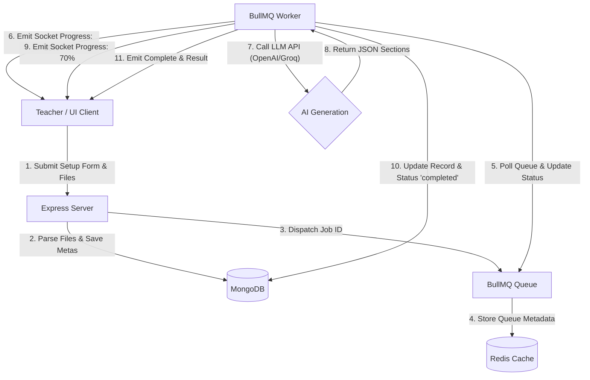

# 🎓 VedaAI - Professional AI-Powered Assessment Creator

<p align="center">
  
  
  
  
  
  
</p>

VedaAI is an state-of-the-art, full-stack AI-powered assessment creator designed specifically for teachers and educators. It enables prompt-based and document-assisted generation of fully customized, high-quality, structured question papers. Armed with background queue handling and real-time live-progress tracking, VedaAI guarantees a seamless, robust, and highly interactive user experience.

---

## ✨ Features

- 🧠 **Dual-Engine AI Generation**: Leverage the power of OpenAI's GPT-4 or the lighting-fast speed of Groq (Llama 3.1 8B) to craft rich academic assessments.
- 🗎 **Document Reference Support**: Upload reference files (`.txt`, `.pdf`, etc.) to base questions on specific textbook passages, chapters, or syllabus guidelines.
- ⏱️ **Real-time Progress Tracking**: Powered by WebSockets (Socket.io) to deliver live creation updates and job progress directly to the frontend.
- 📥 **Background Processing**: Employs Redis and BullMQ to manage asynchronous generation tasks without blocking server threads or client interactions.
- 📑 **Structured Layouts**: Automatically generates clear, section-based question papers (e.g., Section A, Section B) categorized by custom instructions, marks, and mixed difficulty settings (*Easy*, *Medium*, *Hard*).
- 🎨 **Modern Glassmorphic UI**: Beautiful, interactive user interface crafted using Next.js 14, Zustand, Tailwind CSS, and fully styled with elegant micro-animations.
- 📄 **Premium PDF Export**: Instantly export and download generated question papers as printable sheets with clean typographic styling.

---

## 🏗️ Architecture & Data Flow

VedaAI utilizes a robust asynchronous messaging architecture to handle heavy LLM generation workloads smoothly. Below is the workflow layout of how VedaAI manages request queues, AI integration, and live user feedback.



---

## 🛠️ Tech Stack & Directory Structure

### Directory Layout
```
VedaAi/
├── frontend/                     # Next.js App Router Frontend
│   ├── src/
│   │   ├── app/
│   │   │   ├── layout.tsx        # Global HTML Layout & Fonts
│   │   │   ├── globals.css       # Tailwind CSS Core & Animations
│   │   │   ├── page.tsx          # Landing & Core Portal Interface
│   │   │   ├── create-assignment/# Intuitive Step-by-Step Generator Form
│   │   │   └── result/[jobId]/   # Real-time Progress & PDF Download Page
│   │   └── store/
│   │       └── assignmentStore.ts# Zustand Global UI & WebSocket Store
│   ├── tailwind.config.ts        # Custom UI Gradients & Keyframes
│   └── package.json
│
├── backend/                      # Node.js + Express + TypeScript API Server
│   ├── src/
│   │   ├── config/
│   │   │   ├── database.ts       # MongoDB Mongoose Configuration
│   │   │   └── redis.ts          # Redis Cache Client Initializer
│   │   ├── models/
│   │   │   └── Assignment.ts     # MongoDB Schema (IAssignment & ISection)
│   │   ├── routes/
│   │   │   └── assignment.ts     # CRUD & Multi-part Upload Routing
│   │   ├── queue/
│   │   │   └── setup.ts          # BullMQ Queue and Worker Lifecycle
│   │   ├── services/
│   │   │   └── aiService.ts      # LLM Prompt Engineering & Fallbacks
│   │   ├── websocket.ts          # Socket.io Rooms and Client Events
│   │   └── index.ts              # Express Server Entry & Initialization
│   └── package.json
│
├── package.json                  # Root Monorepo configuration
└── README.md
```

---

## 🚀 Setup & Installation

Follow these steps to run VedaAI locally on your developer environment.

### 1. Prerequisites
Ensure you have the following installed:
*   [Node.js](https://nodejs.org/) (v18 or higher)
*   [MongoDB](https://www.mongodb.com/) (running instance or cloud URI)
*   [Redis](https://redis.io/) (running instance or cloud URI)
*   [Docker](https://www.docker.com/) *(optional, recommended for fast database spin-up)*

---

### 2. Fast Database Provisioning (Docker Setup)
If you don't have local installations of Redis or MongoDB, you can run them instantly via Docker:

```bash
# Start MongoDB Container
docker run -d -p 27017:27017 --name veda-mongo mongo:latest

# Start Redis Container
docker run -d -p 6379:6379 --name veda-redis redis:latest
```

---

### 3. Setup Project Environment Configurations

#### Backend Environment Settings (`backend/.env`)
Create a `.env` file in the `backend/` folder and populate it:

```env
PORT=5000
MONGODB_URI=mongodb://localhost:27017/veda-ai
REDIS_URL=redis://localhost:6379
NODE_ENV=development

# --- AI Configuration Keys ---
# Provide either a Groq API Key (Recommended for speed) OR an OpenAI API Key:
GROQ_API_KEY=your_groq_api_key_here
OPENAI_API_KEY=your_openai_api_key_here
```

#### Frontend Environment Settings (`frontend/.env.local`)
Create a `.env.local` file in the `frontend/` folder:

```env
NEXT_PUBLIC_API_URL=http://localhost:5000
NEXT_PUBLIC_WS_URL=http://localhost:5000
```

---

### 4. Install Dependencies

You can install all root, frontend, and backend packages in a single command using workspaces:

```bash
# Install everything from the root directory
npm install
```

---

### 5. Running the Application

VedaAI is equipped with a `concurrently` run command that fires both servers at once.

```bash
# Start both Backend and Next.js Frontend in development mode
npm run dev
```

*   **Next.js Web Portal**: [http://localhost:3000](http://localhost:3000)
*   **Backend REST Server**: [http://localhost:5000](http://localhost:5000)
*   **API Health Gateway**: [http://localhost:5000/health](http://localhost:5000/health)

---

## 🔧 REST API Documentation

All endpoints are prefixed with `/api/assignments`.

### 1. Create New Assignment (Asynchronous Queue Start)
*   **Method**: `POST`
*   **Endpoint**: `/api/assignments`
*   **Content-Type**: `multipart/form-data`
*   **Parameters**:
    *   `title` (string, required): Title of the assessment paper.
    *   `subject` (string, required): Target topic or subject name.
    *   `dueDate` (string/Date, required): Schedule limit or date.
    *   `questionTypes` (JSON array or string, required): Array of formats (e.g. `["multiple-choice", "short-answer", "long-answer"]`).
    *   `totalQuestions` (number, required): Range: `1` to `50`.
    *   `totalMarks` (number, required): Range: `1` to `1000`.
    *   `difficulty` (string, required): Options: `"easy" | "medium" | "hard" | "mixed"`.
    *   `instructions` (string, optional): Extra stylistic instructions for the AI prompt.
    *   `file` (binary, optional): A text or PDF reference file to feed directly into the prompt contextual engine.

*   **Sample JSON Response**:
    ```json
    {
      "jobId": "23faedc8-10b2-4d7a-a6ec-e15264b971a8",
      "assignmentId": "65b5cb3c82af43a0f7ea8942"
    }
    ```

---

### 2. Get Single Assignment details
*   **Method**: `GET`
*   **Endpoint**: `/api/assignments/:id`
*   **Sample JSON Response**:
    ```json
    {
      "_id": "65b5cb3c82af43a0f7ea8942",
      "title": "Data Structures & Algorithms Midterm",
      "subject": "Computer Science",
      "dueDate": "2026-06-15T00:00:00.000Z",
      "questionTypes": ["multiple-choice", "short-answer"],
      "totalQuestions": 10,
      "totalMarks": 50,
      "difficulty": "medium",
      "status": "completed",
      "sections": [
        {
          "id": "section-0",
          "title": "Section A",
          "instruction": "Attempt all questions",
          "questions": [
            {
              "id": "q-0-0",
              "text": "What is the worst-case time complexity of quicksort?",
              "difficulty": "easy",
              "marks": 5,
              "type": "multiple-choice"
            }
          ]
        }
      ],
      "createdAt": "2026-05-28T22:00:00.000Z"
    }
    ```

---

### 3. Get Assignment by Job ID
*   **Method**: `GET`
*   **Endpoint**: `/api/assignments/job/:jobId`

---

### 4. Re-queue / Regenerate Question Paper
Trigger a new execution worker to regenerate questions for the given assessment using identical settings.
*   **Method**: `POST`
*   **Endpoint**: `/api/assignments/:jobId/regenerate`
*   **Sample JSON Response**:
    ```json
    {
      "success": true
    }
    ```

---

### 5. Get All Assignments (History Catalog)
*   **Method**: `GET`
*   **Endpoint**: `/api/assignments`

---

### 6. Delete Assignment Record
*   **Method**: `DELETE`
*   **Endpoint**: `/api/assignments/:id`

---

## 📡 WebSocket API (Socket.io Gateway)

To establish connection and listen to real-time process updates, connect your client to the server instance and register events.

### Client-to-Server Event: `join-job`
Join a dedicated channel/room based on the `jobId` to receive updates.
```javascript
// Payload
socket.emit('join-job', 'jobId-uuid-string');
```

### Server-to-Client Event: `job-status`
Receives progressive task states from the background worker.

#### Payload Schema (Processing Update)
```json
{
  "status": "processing",
  "progress": 30
}
```

#### Payload Schema (Success Complete)
```json
{
  "status": "completed",
  "progress": 100,
  "result": {
    "_id": "mongo-id",
    "title": "Physics Final Exam",
    "sections": [ ... ]
  }
}
```

#### Payload Schema (Failed Job)
```json
{
  "status": "failed",
  "error": "Failed to connect to OpenAI service gateway"
}
```

---

## 🧪 Testing

Both backend and frontend can be tested using default configurations:

```bash
# Test backend
cd backend
npm run lint

# Build test
npm run build
```

---

## 📦 Production Builds

To package and compile files ready for production deployment:

```bash
# Runs production builds in both frontend & backend workspaces
npm run build

# Start the node server
npm run start
```

---

## 📄 License
This project is licensed under the MIT License - see the LICENSE file for details.

---

## 🤝 Contributing
1. Fork this repository.
2. Create your feature branch (`git checkout -b feature/AmazingFeature`).
3. Commit your changes (`git commit -m 'Add some AmazingFeature'`).
4. Push to the branch (`git push origin feature/AmazingFeature`).
5. Open a **Pull Request**.

---

<p align="center">Made with ❤️ for Educators everywhere</p>
